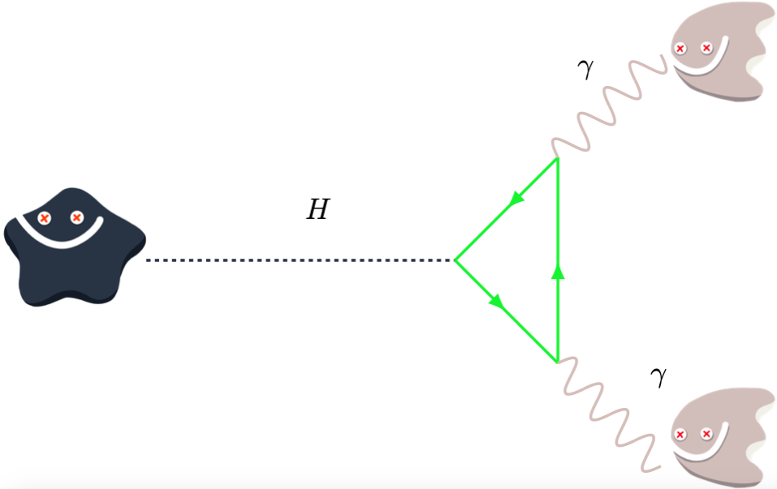

# How-to-rediscover-the-Higgs 
## Jupyter notebook with steps to rediscover the Higgs boson yourself!
------

## Get help

This live google doc will be updated with hints https://docs.google.com/document/d/1gBp7CDJodkajB_KjLCb-6AuHMt5tELokGTQRITP-7n8/edit

## Get Started (online)
Click on this link --> 

Click on the .ipynb file

## Get Started (on your own laptop)
Download this repository as a ZIP https://github.com/meevans1/how-to-rediscover-the-higgs-with-photons/archive/master.zip

Unzip the file in the Downloads folder on your computer

Open a [Jupyter notebook](https://jupyter.org) using your favourite [Python](https://www.python.org) (3.6 or above) environment (mine is [Anaconda](https://www.anaconda.com/distribution/))

Click on the .ipynb file (either the original one you downloaded or your version that you downloaded)

